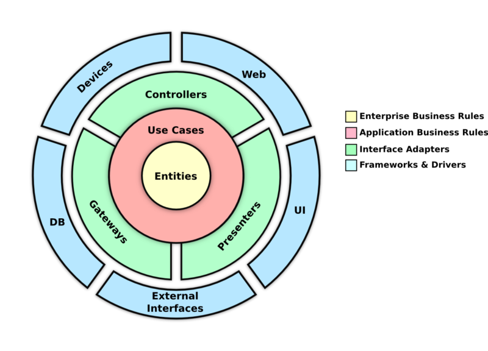

<h5 align="center">
  
  <a name="logo" href="https://android.jlelse.eu/thoughts-on-clean-architecture-b8449d9d02df" target="_blank" rel="noopener noreferrer">
  Image credit
  </a>
   

</h5>

 

# Clean Code e Clean Architecture

 

Projeto da primeira turma do<a href="https://app.agilecode.com.br/public/products/cd4aea57-4b43-41e9-bda5-f487c3817b29" target="_blank" rel="noopener noreferrer"> curso de Clean Code e Clean Architecture </a>com Rodrigo Branas.

 
 

<h3>
🚧 Curso em andamento 🚧
</h3>

 
 
 
 
 
 

---

Kilson 👋 &nbsp;[See my linkedin](https://www.linkedin.com/in/kilsonrs/)
